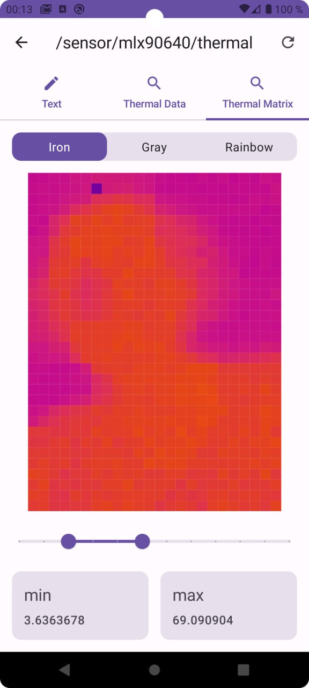

# IoT Home Connector Project

## Made by:

* AlexCawl [@fantasmagorius](https://t.me/fantasmagorius)

## Description

> It is a mobile client (Android) for viewing messages from a home MQTT server in a special,
> pre-defined format. Originally created for the sake of a screen with thermal matrices.
> There wasn't any determined design, so it is looking like a sandbox playground for anything
> @Composable.

## Images

### Thermal matrix

### Network connection statusbar

### Network connection config

### Alert Dialog with InputField? Why not :)

## Features

* Dagger
    * Component Dependencies
* Jetpack Compose 💘
    * Navigation
    * some kind of custom MVI
    * Splash screen
    * Custom extended Material3
    * A lot of custom @Composables
* Gradle
    * Convention plugins
    * Multi-module project
    * Gradle submodules
* Kotlin
    * Coroutines
    * DSL
